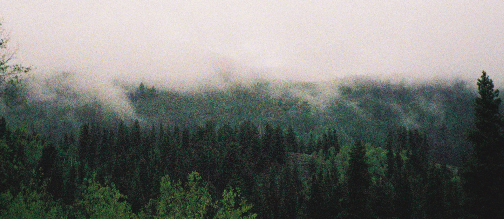
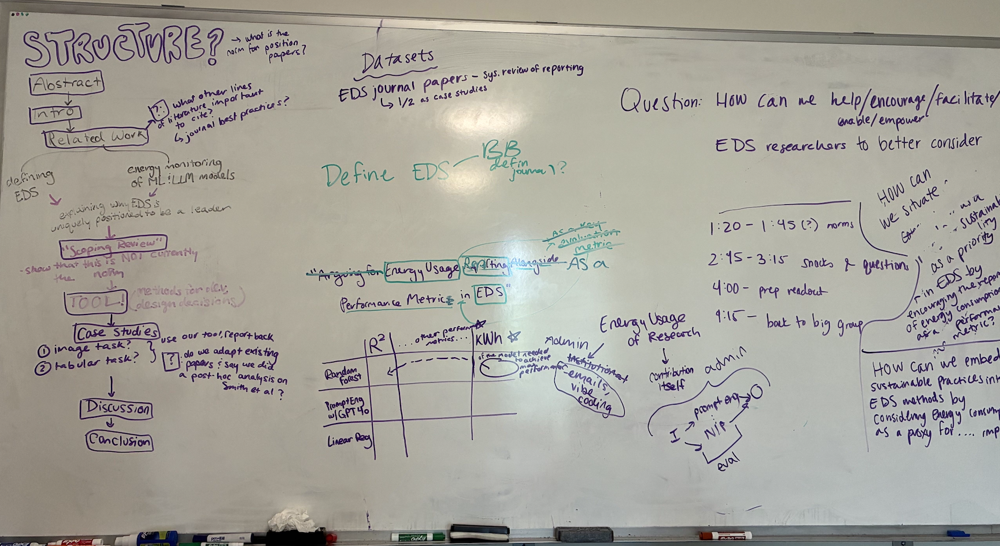
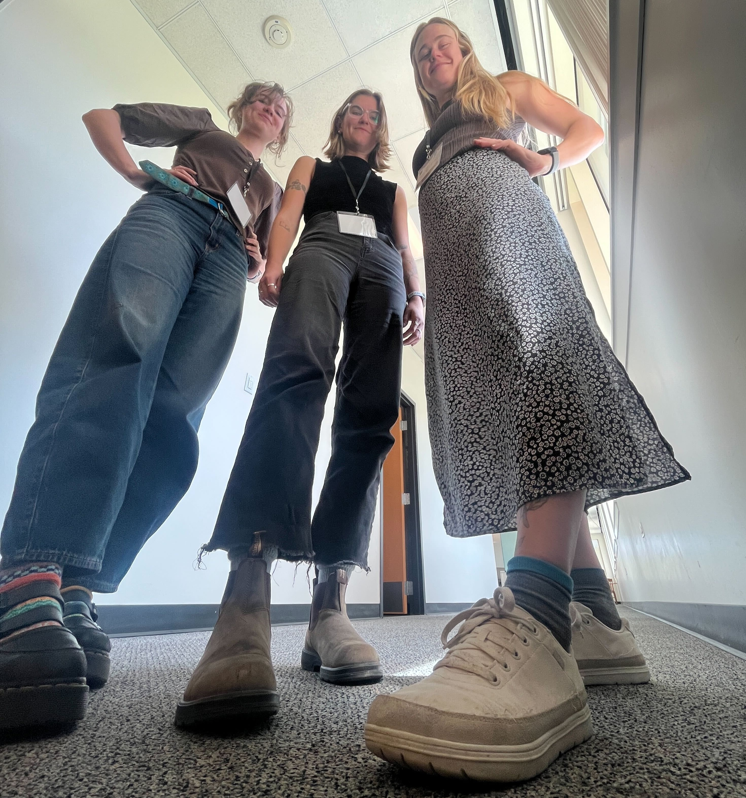

!!! tip "How to use this page during the Summit"
    - This page is your team’s shared workspace and final report-out page. It captures your group’s process and thinking throughout the Summit and will be used to share your work with others. 
    
    - Use this page as your team’s working record during the Summit and your final report-out.
    
    - The Summit has several different goals and thus you will use the page differently each day: Day 1 is for alignment, Day 2 is for building one useful thing, and Day 3 is for synthesis and report- out.
    
    - Look for the green buttons to indicate what you need to edit. 
    
    - Megaphones 📣 indicate which items you will be presenting during the end-of-day report-outs.

    - Only the items with megaphones will be visible when you hit the 'Summit Report Out' button. 

    - If you turn off 'Instructions' then you will only see the page content for public display.
    

# Team 1 Home: Energy Usage Reporting as a Performance Metric in Environmental Data Science

!!! tip "For ESIIL staff"
    Group Number: 1
    
    Breakout Room #: S240

    [ESIIL staff edit in Markdown](https://github.com/CU-ESIIL/Summit_group_2026_1/edit/main/docs/index.md?plain=1#L28){ .md-button target="_blank" rel="noopener" }
    

!!! note "How to replace the image above"
    Upload an image that represents your project and welcome people to your page. 
    
    Upload your own image to `docs/assets/hero/` and replace the file named `hero.png`. Use a wide image if you can, then refresh the site preview to check how it looks.
    Keep the file path `docs/assets/hero/hero.png` if you want the Markdown above to keep working.

    [Open image folder for changing image](https://github.com/CU-ESIIL/Summit_group_2026_1/tree/main/docs/assets/hero){ .md-button target="_blank" rel="noopener" }

[See a completed example](example.md){ .md-button }

## People { #people .oasis-report-out-context }

| Name | Affiliation | Contact | Github | OrcID |
|---|---|---|---|---|
| Rachel Peterson | CU Boulder / NOAA | rachel.peterson-3@colorado.edu | https://github.com/r-petes | https://orcid.org/0009-0007-2048-8268|
| Dylan Van Bramer | | | |
| Bea Bock | NAU / USDA | bmb646@nau.edu / beabockm@gmail.com | https://github.com/beabock | https://orcid.org/0000-0003-2240-9360

## Team Norms and Decision Making { #team-norms-and-decision-making }

!!! note "Day 1 task"

    Suggested Self-Facilitation Instructions:
    
    - Round Robin: Everyone shares 1 norm that they think will be important for their team during the Summit and perhaps following the Summit (2 min).

    - After everyone has shared, make a list with as many norms as possible in GitHub (5–7 min).

    - Vote on your top 3 ideas. (Each person gets 3 votes; you can use all your votes on 1 idea or spread them out) (2 min).

    - In GitHub, move all team norms with votes to the top of the list.

    | Gradients of agreement | 
    |---|
    |  | 

    [Edit Team Norms in Markdown](https://github.com/CU-ESIIL/Summit_group_2026_1/edit/main/docs/index.md?plain=1#L87){ .md-button target="_blank" rel="noopener" }

Our team norms:

AI - Keeping track of how we use it:
- keep track of prompts
- keep all convos with LLMs in one thread when possible so we can easily keep track
- Drafting full prose -- no using AI
- Report environmental impact of our paper in terms of AI usage

Decision-making:
- Voting
- Spectrum of how much we agree/disagree - vetos are allowed

Even turn-taking:
- Let people finish their sentences

Ask questions:
- No stupid questions
- What's shared here stays here, what's learned here leaves here
- Write down questions as often as possible

Reflection points:
- Check-ins often on how we're feeling/what we're doing, going back to guiding questions

Expectations:
- Clear about what we are doing and by when, what our capacities are

Communication:
- Slack channel
- Turn on notifications (or whatever feels best for you)

What a final product looks like:
- Being transparent about if we think something is not good enough

## Our product(s) 📣 { #product-direction .oasis-report-out-section .oasis-report-out-day2 }

!!! note "Day 2 Tasks"
    Morning Focus: questions, hypotheses, context; add at least one visual (photo of whiteboard/notes)

    Afternoon Focus: try a few datasets and analyses. Keep it visual, keep it simple. Update the site to reflect what you test. 

    [Edit content below here in Markdown](https://github.com/CU-ESIIL/Summit_group_2026_1/edit/main/docs/index.md?plain=1#L106){ .md-button target="_blank" rel="noopener" }

We plan to write a position paper proposing that researchers in the fields of environmental data science should incorporate consideration of the energy costs of modeling choices alongside other performance metrics, including creating a prototype of a "calculator" for the most common analytical methods within the field to make this reporting process streamlined.

## Our question(s) 📣 { #project-question .oasis-report-out-section .oasis-report-out-day2 }

How can we situate environmental sustainability as a priority in environmental data science by encouraging the reporting of energy consumption as a performance metric?

## Hypotheses/Intentions

We expect that it is not the norm to include information about considering energy consumption or other sustainability metrics in reporting about methodological choices for environmental data science / analysis. 

## Why this matters (the “upshot”) 📣 { #why-this-matters .oasis-report-out-section .oasis-report-out-day2 }

This matters because:

Environmental data scientists are uniquely positioned to be leaders in creating holistic decision-making processes incorporating sustainability metrics when using AI or other analytical tools. 

People who could use this:

Environmental data scientists, or scientists in other domains concerned with holistic research method decision-making.  

## Data sources we’re exploring 📣 { #data-exploration .oasis-report-out-section .oasis-report-out-day2 }

!!! note "data exploration"
    Provide a snapshot showing some initial data patterns. 

    Add 2-4 promising data sources (links +1-line notes)    

Promising data sources:

- Investigating the norms in current reporting in the Environmental Data Science journal, with 1-2 as case studies with the tool.

Example: Pourzangbar A, Franca MJ. How reliable are retrieval-augmented and standard ChatGPT models to support flood susceptibility mapping? Environmental Data Science. 2026;5:e10. doi:10.1017/eds.2026.10037

## Methods/technologies we’re testing 📣 { #methods-and-code .oasis-report-out-section .oasis-report-out-day2 }

Intro:
- Defining environmental data science (EDS)
- Explaining why EDS is uniquely positioned to be a leader - encouraging methodologies to reflect environmental priorities!

Related work:
- Energy monitoring of ML / LLM models 

Scoping review:
- Determine common analytical methods & performance metrics to determine those methods used among EDS published papers - ~180 published
- Show that this is not currently the norm

Tool:
- Discuss methods for tool development
- Discuss design decisions

Case studies:
1. Image task
2. Tabular task
Use our tool, report back. Post-hoc analysis on existing papers?

Discussion:

Conclusion:

!!! note "methods"
    Add 2-4 methods/technologies we're testing (stats, models, viz).

[View shared code](https://github.com/CU-ESIIL/Summit_group_2026_1/tree/main/code){ .md-button }

### Challenges identified

- ...
- ...

### Visuals

### Next Steps

Short term: 
- Spend 20 minutes each going through 2-3 articles
- Agree on definitions - environmental data science, models, anything else?
- Nail down calculations
- Tech stack for tool, dev plan (package or website)
- Prepare final report back

Long term: 
- Paper draft
- Develop tool
- Be happy

!!! note "Day 3 Tasks"
    Sythesis: highlight 2-3 visuals that tell the story; keep text crisp. Practice a 6-minute walkthrough of the homepage. Why -> Questions -> Data/Methods -> Findings -> Next 

    [Edit content below here in Markdown](https://github.com/CU-ESIIL/Summit_group_2026_1/edit/main/docs/index.md?plain=1#L203){ .md-button target="_blank" rel="noopener" }

## Team Photo { #team-photo }

*Team members and collaborators who contributed to this project.*

## Findings at a glance 📣 { #findings-at-a-glance .oasis-report-out-section .oasis-report-out-day3 }

Headline 1 — what, where, how much

...

Headline 2 — change/trend/contrast

...

Headline 3 — implication for practice or policy

...

## Visuals that tell a story 📣 { #story-visuals .oasis-report-out-section .oasis-report-out-day3 }

*Visual 1: the main pattern or output we want people to remember.*

## What’s next? 📣 { #whats-next .oasis-report-out-section .oasis-report-out-day3 }

Short term:

- ...

Long term:

- ...

Who should see this next

- ...

## Cite & Reuse { #cite-reuse }

If you use these materials, please cite:

Summit Team. (2026). *Summit_group_2026_1 — Innovation Summit 2026*. https://github.com/CU-ESIIL/Summit_group_2026_1

License: CC-BY-4.0 unless noted. 
